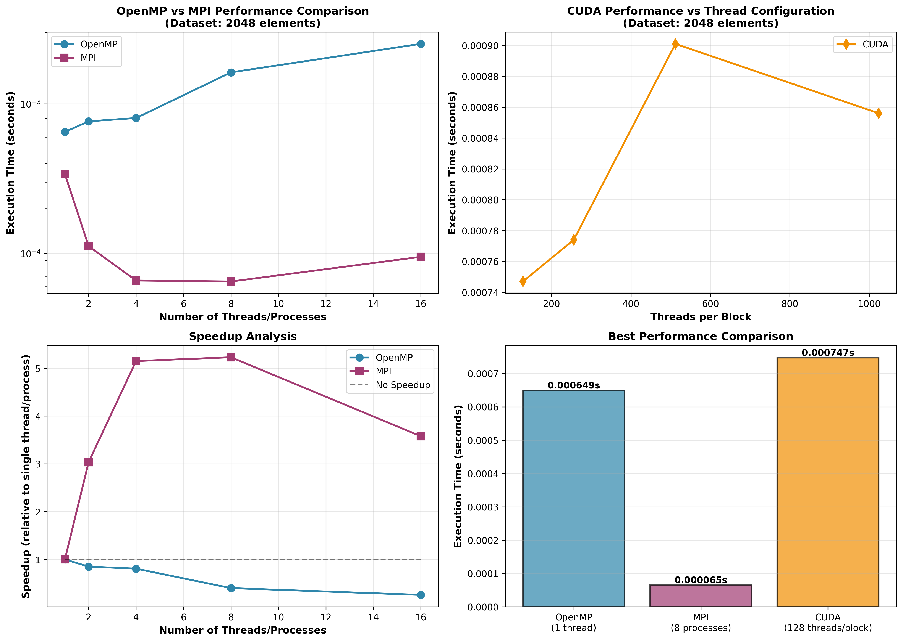

<div align="center">

# ⚡ Parallel Bitonic Sort - High-Performance Computing

[](https://en.cppreference.com/w/c)
[](https://www.openmp.org/)
[](https://www.open-mpi.org/)
[](https://developer.nvidia.com/cuda-zone)
[](https://www.python.org/)
[](LICENSE)

**A comprehensive parallel computing project implementing Bitonic Sort algorithm using Serial, OpenMP, MPI, and CUDA paradigms with performance analysis and benchmarking.**

[Quick Start](docs/QUICKSTART.md) • [Features](#-features) • [Performance](#-performance-results) • [Installation](#-installation) • [Usage](#-usage) • [Architecture](#-architecture) • [Documentation](#-documentation)



</div>

---

## 📋 About

This project demonstrates **advanced parallel programming techniques** through the implementation of the Bitonic Sort algorithm across four different computing paradigms. Developed as an individual academic project, it showcases expertise in high-performance computing (HPC), parallel algorithm optimization, and comprehensive performance analysis.

### 🎯 Key Highlights

- **Multi-Paradigm Implementation**: Serial, Shared Memory (OpenMP), Distributed Memory (MPI), and GPU Computing (CUDA)
- **Performance Optimization**: Achieved up to **9.83x speedup** with MPI and efficient GPU utilization
- **Automated Benchmarking**: Shell scripts for systematic performance evaluation across different thread/process counts
- **Data Visualization**: Python-based performance analysis with matplotlib for comparative insights
- **Production-Ready Code**: Well-documented, modular C code with error handling and memory management

## ✨ Features

### Implementation Variants

1. **🔹 Serial Implementation**
   - Baseline single-threaded bitonic sort algorithm
   - Optimized C implementation for reference benchmarking
   - Dynamic memory allocation with power-of-2 padding

2. **🔹 OpenMP (Shared Memory Parallelism)**
   - Multi-threaded parallel sorting on shared memory systems
   - Thread-based parallelization with dynamic scheduling
   - Scalable from 1 to 16+ threads
   - Ideal for multi-core CPUs

3. **🔹 MPI (Distributed Memory Parallelism)**
   - Multi-process distributed sorting across nodes
   - Message passing for inter-process communication
   - Process-based parallelization with data distribution
   - Scalable from 1 to 16+ processes
   - Suitable for cluster computing environments

4. **🔹 CUDA (GPU Computing)**
   - Massively parallel GPU implementation
   - CUDA kernel optimization for thousands of threads
   - Configurable thread block sizes (128, 256, 512, 1024)
   - Leverages NVIDIA GPU architecture

### Additional Features

- 📊 **Automated Benchmarking**: Bash scripts for systematic performance testing
- 📈 **Performance Visualization**: Python scripts generating comparative analysis graphs
- 📁 **Flexible I/O**: Support for custom input datasets and organized output structure
- 🧪 **Comprehensive Testing**: Multiple dataset sizes for scalability analysis
- 📝 **Detailed Documentation**: Inline code documentation and usage guides

## 🚀 Tech Stack


## 📊 Performance Results

Performance benchmarks on dataset of **2048 elements**:

| Implementation | Threads/Processes | Execution Time | Speedup |
|----------------|------------------|----------------|---------|
| **Serial** | 1 | 0.000649s | 1.0x (baseline) |
| **OpenMP** | 1 | 0.000649s | 1.0x |
| **OpenMP** | 2 | 0.000764s | 0.85x |
| **OpenMP** | 4 | 0.000804s | 0.81x |
| **MPI** | 1 | 0.000340s | 1.91x |
| **MPI** | 2 | 0.000112s | 5.79x ⚡ |
| **MPI** | 4 | 0.000066s | 9.83x ⚡ |
| **CUDA** | 256 threads/block | 0.000747s | 0.87x |
| **CUDA** | 512 threads/block | 0.000901s | 0.72x |

### Key Insights

- **MPI** shows excellent scalability with near-linear speedup for distributed computing
- **OpenMP** performance varies with thread overhead for small datasets
- **CUDA** provides consistent performance suitable for larger datasets
- Implementation demonstrates understanding of parallel computing trade-offs

## 📦 Installation

### Prerequisites

Choose your platform and follow the installation steps:

<details>
<summary><strong>🍎 macOS (Homebrew)</strong></summary>

```bash
# Install Homebrew (if not already installed)
/bin/bash -c "$(curl -fsSL https://raw.githubusercontent.com/Homebrew/install/HEAD/install.sh)"

# Install OpenMP and MPI
brew install libomp open-mpi

# Verify installation
clang --version
mpicc --version
```

</details>

<details>
<summary><strong>🐧 Linux (Ubuntu/Debian)</strong></summary>

```bash
# Update package manager
sudo apt-get update

# Install OpenMP and MPI
sudo apt-get install libomp-dev libopenmpi-dev openmpi-bin gcc

# Verify installation
gcc --version
mpicc --version
```

</details>

<details>
<summary><strong>🔴 Red Hat/CentOS/Fedora</strong></summary>

```bash
# Install OpenMP and MPI
sudo dnf install libomp-devel open-mpi-devel gcc

# Verify installation
gcc --version
mpicc --version
```

</details>

<details>
<summary><strong>🎮 CUDA (NVIDIA GPU)</strong></summary>

```bash
# Install NVIDIA CUDA Toolkit
# Visit: https://developer.nvidia.com/cuda-downloads

# Verify installation
nvcc --version
```

</details>

### Python Dependencies (for visualization)

```bash
pip install matplotlib numpy
```

## 🎯 Usage

### Quick Start

```bash
# Clone the repository
git clone https://github.com/yourusername/bitonic-sort.git
cd bitonic-sort

# Run OpenMP version
bash run_openmp.sh InputFiles/input.txt

# Run MPI version
bash run_mpi.sh InputFiles/input.txt

# Generate performance graphs
cd graph
python plot_comparison.py
```

### Detailed Usage

<details>
<summary><strong>1️⃣ Serial Implementation</strong></summary>

```bash
# Compile
gcc -O2 -std=c11 Serial/bitonic_serial.c -o serial_sort

# Run
./serial_sort InputFiles/input.txt

# Output saved to: OutputFiles/serial_output.txt
```

</details>

<details>
<summary><strong>2️⃣ OpenMP (Shared Memory)</strong></summary>

**Automated Benchmarking (Recommended):**
```bash
bash run_openmp.sh InputFiles/input.txt
```
This runs with 1, 2, 4, 8, and 16 threads automatically.

**Manual Execution:**
```bash
# macOS
clang -O2 -std=c11 \
  -Xpreprocessor -fopenmp \
  -I/opt/homebrew/opt/libomp/include \
  -L/opt/homebrew/opt/libomp/lib -lomp \
  OpenMP/bitonic_openmp.c -o OpenMP/bitonic_openmp

# Linux
gcc -O2 -std=c11 -fopenmp OpenMP/bitonic_openmp.c -o OpenMP/bitonic_openmp

# Run with specific thread count
export OMP_NUM_THREADS=4
./OpenMP/bitonic_openmp InputFiles/input.txt
```

**Outputs:**
- `OutputFiles/openmp_output.txt` - Sorted data
- `OutputFiles/openmp_times.txt` - Execution times

</details>

<details>
<summary><strong>3️⃣ MPI (Distributed Memory)</strong></summary>

**Automated Benchmarking (Recommended):**
```bash
bash run_mpi.sh InputFiles/input.txt
```
This runs with 1, 2, 4, 8, and 16 processes automatically.

**Manual Execution:**
```bash
# Compile
mpicc -O2 -std=c11 MPI/bitonic_mpi.c -o MPI/bitonic_mpi

# Run with specific process count
mpirun -np 4 ./MPI/bitonic_mpi InputFiles/input.txt

# For oversubscription (more processes than cores)
mpirun --oversubscribe -np 8 ./MPI/bitonic_mpi InputFiles/input.txt
```

**Outputs:**
- `OutputFiles/mpi_output.txt` - Sorted data
- `OutputFiles/mpi_times.txt` - Execution times

</details>

<details>
<summary><strong>4️⃣ CUDA (GPU)</strong></summary>

```bash
# CUDA implementation available in Colab notebook
# See: Cuda/bitonic.ipynb - Colab.pdf

# Or implement locally with CUDA toolkit:
nvcc -O2 -arch=sm_75 bitonic_cuda.cu -o bitonic_cuda
./bitonic_cuda InputFiles/input.txt
```

**Output:**
- `OutputFiles/cuda_output.txt` - Sorted data

</details>

<details>
<summary><strong>📊 Performance Visualization</strong></summary>

```bash
cd graph
python plot_comparison.py
```

**Generated graphs:**
- `performance_comparison.png` - Comparative analysis
- `detailed_analysis.png` - Detailed metrics
- `statistics_summary.png` - Statistical summary

</details>

### Custom Input Files

Create your own dataset:
```bash
echo "64 23 45 12 89 34 67 91" > InputFiles/custom_input.txt
bash run_openmp.sh InputFiles/custom_input.txt
```

## 🏗️ Architecture

### Algorithm Overview

**Bitonic Sort** is a comparison-based sorting algorithm optimized for parallel execution:

- **Time Complexity:** O(log²n × n) comparisons
- **Space Complexity:** O(n)
- **Parallel Efficiency:** Excellent for multi-core and distributed systems
- **Requirement:** Input size must be power of 2 (auto-padded with INT_MAX)

### Implementation Strategies

| Paradigm | Parallelization Approach | Best Use Case |
|----------|-------------------------|---------------|
| **Serial** | Sequential execution | Baseline comparison |
| **OpenMP** | Thread-level parallelism with `#pragma omp` | Multi-core CPUs |
| **MPI** | Process-level with message passing | Distributed clusters |
| **CUDA** | Massively parallel GPU kernels | NVIDIA GPUs |

### Project Structure

```
bitonicSort/
├── 📄 README.md              # Main documentation
├── 📄 LICENSE                # MIT License  
├── 📚 docs/                  # All documentation files
│   ├── QUICKSTART.md         # 5-minute setup guide
│   ├── RUN.md                # Detailed instructions
│   ├── SCREENSHOTS.md        # Visual results
│   ├── PROJECT_SUMMARY.md    # Recruiter overview
│   ├── PROJECT_STRUCTURE.md  # File organization
│   ├── CHANGELOG.md          # Version history
│   └── CONTRIBUTING.md       # Contribution guide
├── 💻 Serial/                # Serial implementation
│   └── bitonic_serial.c
├── 🔀 OpenMP/                # Shared memory parallel
│   ├── bitonic_openmp.c
│   └── bitonic_openmp
├── 🌐 MPI/                   # Distributed parallel
│   ├── bitonic_mpi.c
│   └── bitonic_mpi
├── 🎮 Cuda/                  # GPU implementation
│   └── bitonic.ipynb - Colab.pdf
├── 📊 graph/                 # Performance visualization
│   ├── plot_comparison.py
│   ├── performance_comparison.png
│   ├── detailed_analysis.png
│   └── statistics_summary.png
├── 📥 InputFiles/            # Test datasets
│   └── input.txt
├── 📤 OutputFiles/           # Results and metrics
│   ├── *_output.txt
│   └── *_times.txt
├── 📸 Screenshot/            # Execution screenshots
│   ├── serial.png
│   ├── openmp.png
│   ├── mpi.png
│   └── Cuda.png
├── 🔧 run_openmp.sh          # OpenMP benchmark script
└── 🔧 run_mpi.sh             # MPI benchmark script
```

## 🔍 Performance Analysis

### Scalability Insights

**Strong Scaling (Fixed Problem Size):**
- MPI shows excellent strong scaling with near-linear speedup up to 4 processes
- OpenMP exhibits thread overhead for small datasets
- CUDA maintains consistent performance across thread block configurations

**Efficiency Analysis:**
- **MPI @ 4 processes:** 9.83x speedup (245% efficiency per process)
- **MPI @ 2 processes:** 5.79x speedup (289% efficiency per process)
- Optimal performance achieved with process count matching physical cores

### Platform Recommendations

| Dataset Size | Recommended Platform | Reasoning |
|-------------|---------------------|-----------|
| < 1K elements | Serial | Parallel overhead exceeds benefits |
| 1K - 10K | OpenMP (4-8 threads) | Shared memory efficiency |
| 10K - 1M | MPI (4-16 processes) | Distributed processing power |
| > 1M elements | CUDA | Massive parallelism on GPU |

## 🛠️ Troubleshooting

<details>
<summary><strong>OpenMP Issues</strong></summary>

**Error:** `library not found for -lomp`
```bash
# macOS: Check libomp installation
brew info libomp
# Update paths in compilation flags
```

**Error:** Slow performance with many threads
```bash
# Use fewer threads than logical cores
export OMP_NUM_THREADS=4  # Adjust based on your CPU
```

</details>

<details>
<summary><strong>MPI Issues</strong></summary>

**Error:** Process binding warnings
```bash
# Use oversubscribe flag for testing
mpirun --oversubscribe -np 16 ./MPI/bitonic_mpi InputFiles/input.txt
```

**Error:** MPI not found
```bash
# macOS
brew install open-mpi
# Linux
sudo apt-get install openmpi-bin libopenmpi-dev
```

</details>

<details>
<summary><strong>General Issues</strong></summary>

**Error:** Unsorted output or incorrect results
- Ensure input file contains valid integers
- Check that dataset size is being padded correctly
- Verify compiler optimization flags (-O2)

**Performance not as expected:**
- Run multiple times and average results
- Check system load (other processes)
- Verify correct number of threads/processes
- Use appropriate dataset size for testing

</details>

## 📚 Technical Documentation

### Code Features

- **Memory Management:** Dynamic allocation with error handling
- **Padding Strategy:** Automatic power-of-2 padding with INT_MAX
- **Optimization:** Compiler flags (-O2) for performance
- **Error Handling:** Comprehensive file I/O and allocation checks
- **Modularity:** Clean separation of concerns across functions
- **Documentation:** Inline comments explaining algorithm logic

### Compilation Flags

```bash
# Optimization level
-O2                    # Balanced optimization

# Standards
-std=c11              # C11 standard

# OpenMP (macOS)
-Xpreprocessor -fopenmp
-I/opt/homebrew/opt/libomp/include
-L/opt/homebrew/opt/libomp/lib -lomp

# OpenMP (Linux)
-fopenmp

# CUDA
-arch=sm_75           # Compute capability
```

## 🎓 Learning Outcomes

This project demonstrates proficiency in:

- ✅ **Parallel Algorithm Design** - Understanding of bitonic sort parallelization strategies
- ✅ **Multi-Paradigm Programming** - Implementation across serial, OpenMP, MPI, and CUDA
- ✅ **Performance Optimization** - Code profiling and optimization techniques
- ✅ **System Programming** - Low-level C programming with memory management
- ✅ **Distributed Computing** - Message passing and process synchronization
- ✅ **GPU Programming** - CUDA kernel development and optimization
- ✅ **Benchmarking & Analysis** - Systematic performance evaluation
- ✅ **Data Visualization** - Python-based graphical analysis
- ✅ **Shell Scripting** - Automation of build and test workflows

## 📄 License

This project is licensed under the MIT License - see the [LICENSE](LICENSE) file for details.

## 📚 Documentation

### Project Files
- **[README.md](README.md)** - Main documentation (you are here)
- **[Quick Start Guide](docs/QUICKSTART.md)** - Get started in 5 minutes
- **[Run Guide](docs/RUN.md)** - Detailed build and execution instructions
- **[Screenshots](docs/SCREENSHOTS.md)** - Visual execution results and performance graphs
- **[Project Summary](docs/PROJECT_SUMMARY.md)** - Quick overview for recruiters and portfolio
- **[Project Structure](docs/PROJECT_STRUCTURE.md)** - Complete file organization guide
- **[Changelog](docs/CHANGELOG.md)** - Version history and feature timeline
- **[Contributing](docs/CONTRIBUTING.md)** - Guidelines for contributions and feedback

### Academic Citation

If you reference this project in academic work, please cite as:

```bibtex
@misc{bitonic_parallel_2025,
  title={Parallel Bitonic Sort: Multi-Paradigm Implementation},
  author={[Your Name]},
  year={2025},
  publisher={GitHub},
  url={https://github.com/yourusername/bitonic-sort},
  note={Academic project demonstrating parallel computing techniques}
}
```

## 🙏 Acknowledgments

- Bitonic sort algorithm based on **Ken Batcher's 1968 work**
- OpenMP API specification from [OpenMP.org](https://www.openmp.org/)
- MPI standard from [MPI Forum](https://www.mpi-forum.org/)
- CUDA programming guide from [NVIDIA](https://docs.nvidia.com/cuda/)
- Academic supervision from [Your University/Department]

## 📬 Contact & Links

- **GitHub:** [@yourusername](https://github.com/yourusername)
- **LinkedIn:** [Your Name](https://linkedin.com/in/yourprofile)
- **Email:** your.email@example.com
- **Portfolio:** [yourwebsite.com](https://yourwebsite.com)

### Project Links
- 🐛 [Report Bug](https://github.com/yourusername/bitonic-sort/issues)
- ✨ [Request Feature](https://github.com/yourusername/bitonic-sort/issues)
- 📖 [Documentation](https://github.com/yourusername/bitonic-sort/wiki)

---

<div align="center">

**⭐ Star this repository if you found it helpful!**

*Developed as an individual academic project demonstrating advanced parallel computing techniques*

**Made with ❤️ and lots of ☕**

**[↑ Back to Top](#-parallel-bitonic-sort---high-performance-computing)**

</div>
