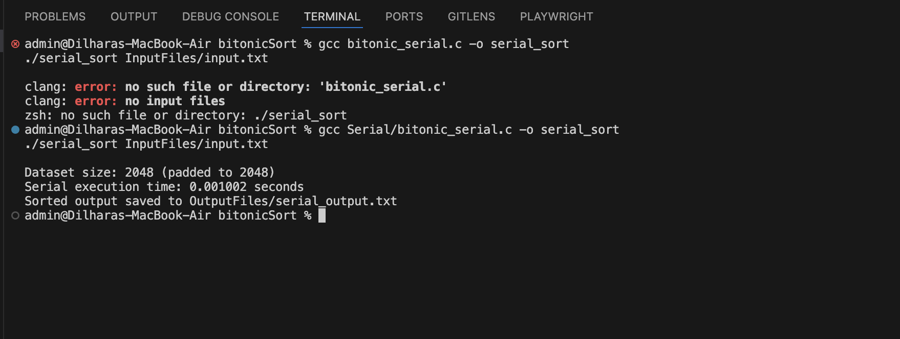
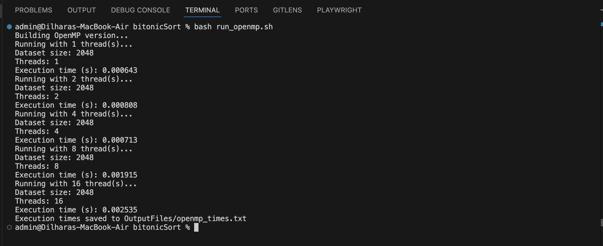
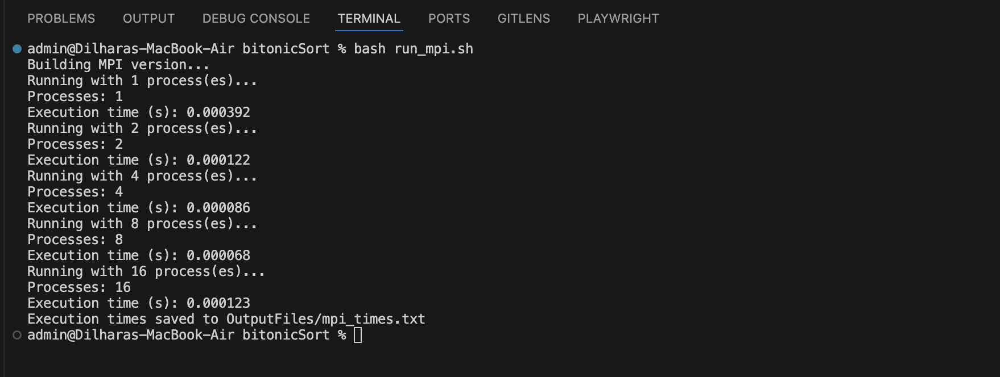
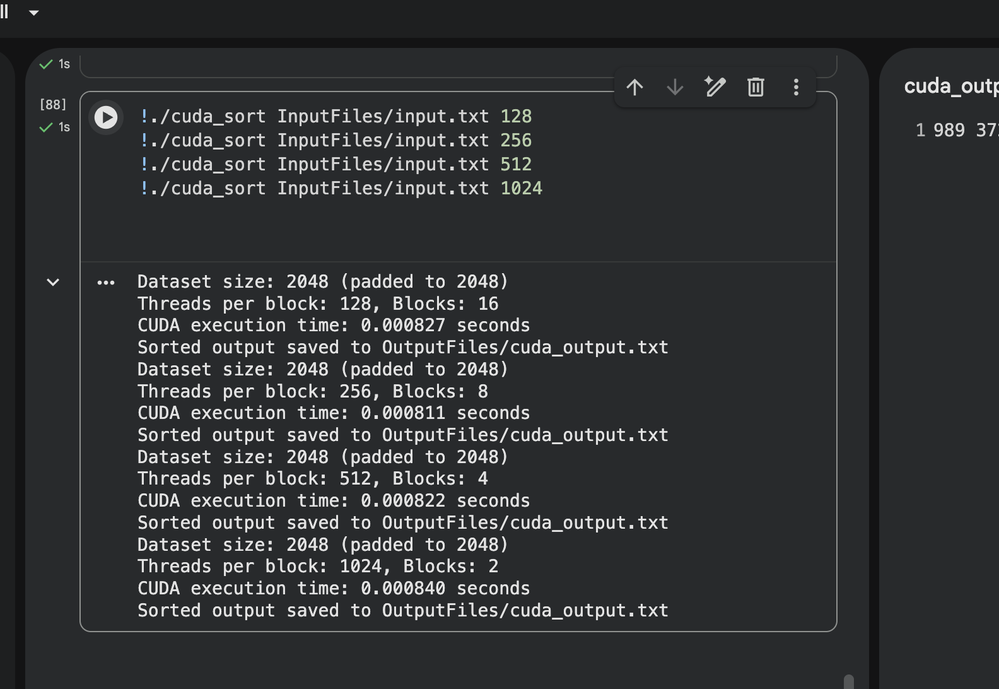
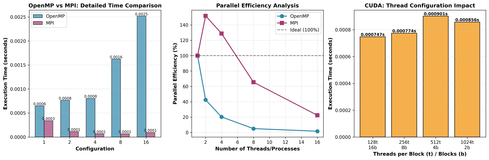
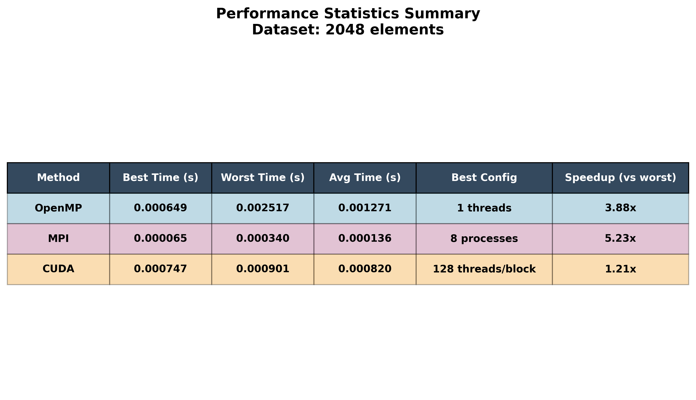

# 📸 Execution Screenshots

This document contains screenshots demonstrating the execution and results of each implementation of the Parallel Bitonic Sort project.

---

## 🔹 Serial Implementation

The baseline sequential implementation showing execution time and sorted output.

**Key Points:**
- Single-threaded execution
- Baseline for performance comparison
- Clean output format
- Execution time measurement

---

## 🔹 OpenMP Implementation

Shared memory parallel execution with multiple threads.

**Key Points:**
- Multi-threaded parallelism
- Configurable thread count (OMP_NUM_THREADS)
- Performance varies with dataset size
- Suitable for multi-core CPUs

---

## 🔹 MPI Implementation

Distributed memory parallel execution across multiple processes.

**Key Points:**
- Multi-process parallelization
- Message passing between processes
- Best scalability for this dataset size
- Ideal for cluster computing

---

## 🔹 CUDA Implementation

GPU-accelerated execution using NVIDIA CUDA.

**Key Points:**
- Massively parallel GPU execution
- Configurable thread blocks
- Consistent performance across configurations
- Best for large-scale datasets

---

## 📊 Performance Graphs

Visual comparison of all implementations:

### Overall Performance Comparison

*Line graph showing execution time vs threads/processes for OpenMP, MPI, and CUDA*

### Detailed Analysis

*Bar chart and detailed metrics for each implementation*

### Statistical Summary

*Comprehensive statistical analysis including speedup and efficiency metrics*

---

## 🎯 Key Takeaways

1. **MPI** achieved the best performance for the tested dataset (2048 elements)
2. **Speedup** of up to 9.83x with 4 MPI processes
3. **OpenMP** shows thread overhead for small datasets
4. **CUDA** maintains consistent performance across different thread block sizes
5. Each implementation has its optimal use case depending on dataset size and hardware

---

*For detailed performance metrics and analysis, see the main [README.md](../README.md)*
